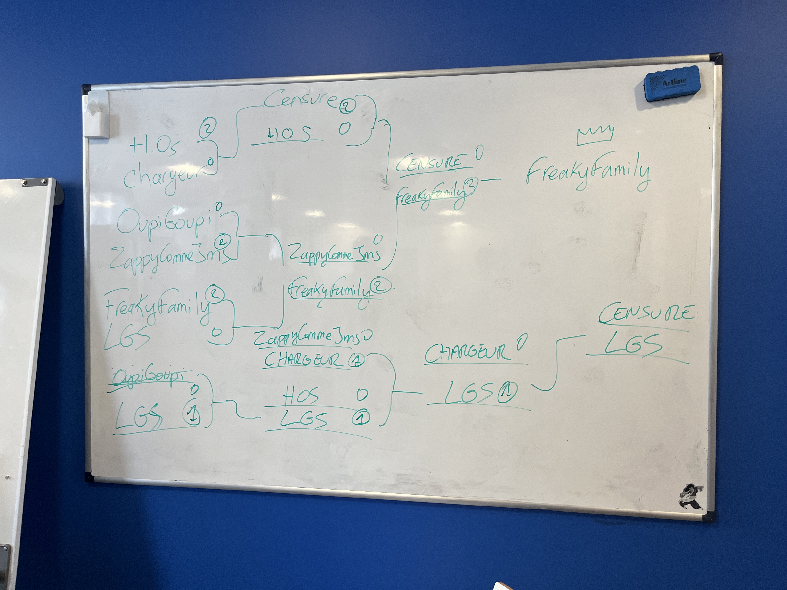

# Zappy

Network game where AIs battle each other

2nd Year End project at EPITECH

Main repository: https://github.com/freaky-family/zappy

> [!CAUTION]
> If you are an Epitech student, you are **NOT** allowed to copy **ANY** of the code present here.
>
> You are also **NOT** allowed to copy the AI strategy / the documentation present in this repository either.
>
> Breaking these rules will cause you to get a -42 on your project.


## Quick introduction

According to the subject, "Zappy" is a game where several teams confront each other on a tile map containing resources.

The goal is to collect enough resources for 6 players of the same team to reach the maximum level (level 8).

The "players" are represented by AIs that automatically move around the terrain. They can interact with the terrain, push other players etc.

## AI

> [!NOTE]
> Our Zappy AI won the **2026 Lyon Zappy AI tournament** 🎊

<details>
    <summary>
        Image of the tourney board
    </summary>
    
</details>

## Build

You can build everything with:
```sh
make
```

However you can build each part seperately:
```sh
make ai
make gui
make server
```

> [!NOTE]
> Requirements for **GUI:**
> - Raylib 6.0
> - raylib-cpp 6.0.1

You can always verify the building process in `.github/workflows/build.yml`.

## Documentation

More documentation is available in the `docs/` folder.

## Group

Server team:
- Hugo ARNAL
- Bastien SUKIENNIK

GUI team:
- Esteban HAZANAS
- Sacha DEFOSSEZ
- Bastien SUKIENNIK

AI team:
- Alexandre KUBIACZYK
- Nadal BERTHELON

Bonus:
- Hector CORDAT-BOURSIAC
